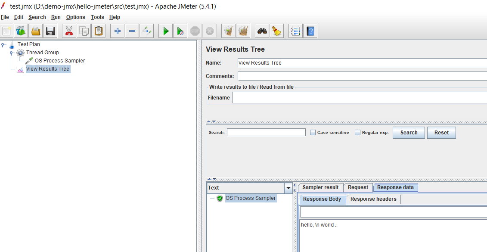

# Hello Jmeter

## Run in command line mode
`jmeter-n.cmd src/test.jmx`, `jmeter -nt src/test.jmx -l test.jtl`

## More info
https://www.blazemeter.com/blog/six-tips-for-jmeter-if-controller-usage
https://jmeter.apache.org/

## Screen shot

